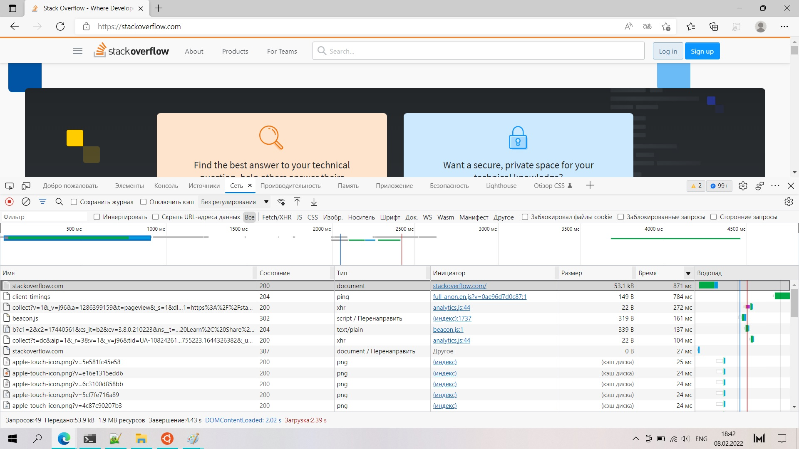
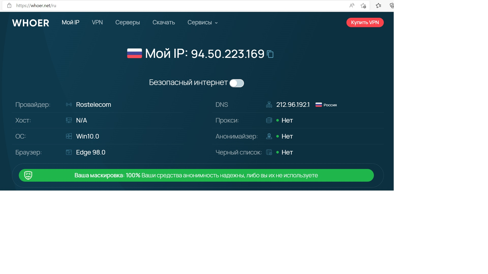
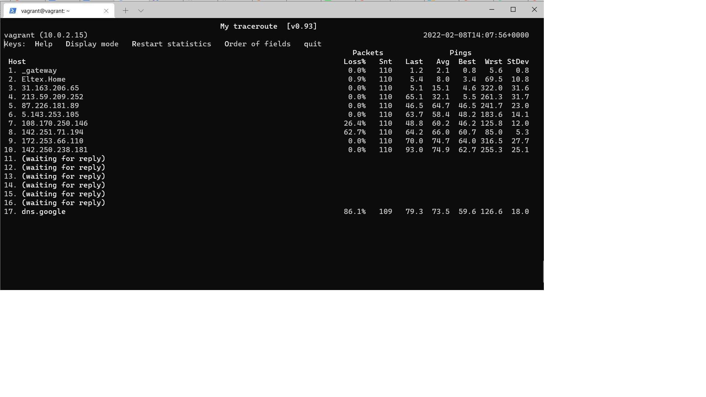

# Домашнее задание к занятию "3.6. Компьютерные сети, лекция 1"

### 1. Работа c HTTP через телнет.

Подключитесь утилитой телнет к сайту stackoverflow.com `telnet stackoverflow.com 80`
отправьте HTTP запрос:
	GET /questions HTTP/1.0
	HOST: stackoverflow.com
	[press enter]
	[press enter]
	
	vagrant@vagrant:~$ telnet stackoverflow.com 80
	Trying 151.101.65.69...
	Connected to stackoverflow.com.
	Escape character is '^]'.
	GET /questions HTTP/1.0
	HOST: stackoverflow.com
	
	HTTP/1.1 301 Moved Permanently
	cache-control: no-cache, no-store, must-revalidate
	location: https://stackoverflow.com/questions
	x-request-guid: 6bdb2b25-e18c-4a64-8c09-a14f8e22dadd
	feature-policy: microphone 'none'; speaker 'none'
	content-security-policy: upgrade-insecure-requests; frame-ancestors 'self' https://stackexchange.com
	Accept-Ranges: bytes
	Date: Tue, 08 Feb 2022 13:21:38 GMT
	Via: 1.1 varnish
	Connection: close
	X-Served-By: cache-fra19137-FRA
	X-Cache: MISS
	X-Cache-Hits: 0
	X-Timer: S1644326498.983354,VS0,VE85
	Vary: Fastly-SSL
	X-DNS-Prefetch-Control: off
	Set-Cookie: prov=f966eed3-48b0-99f9-9aa7-0759a30b927a; domain=.stackoverflow.com; expires=Fri, 01-Jan-2055 00:00:00 GMT; path=/; HttpOnly
	
	Connection closed by foreign host.
	vagrant@vagrant:~$
	
В ответе укажите полученный HTTP код, что он означает?
Сайт переехал навсегда по адресу в location

	HTTP/1.1 301 Moved Permanently
	...
	location: https://stackoverflow.com/questions

### 2. Повторите задание 1 в браузере, используя консоль разработчика F12.
откройте вкладку Network
отправьте запрос `http://stackoverflow.com`
найдите первый ответ HTTP сервера, откройте вкладку Headers

	URL-адрес запроса: http://stackoverflow.com/
	Метод запроса: GET
	Код состояния: 307 Internal Redirect
	Политика источника ссылки: strict-origin-when-cross-origin
	Location: https://stackoverflow.com/
	Non-Authoritative-Reason: HSTS
	Accept: text/html,application/xhtml+xml,application/xml;q=0.9,image/webp,image/apng,*/*;q=0.8,application/signed-exchange;v=b3;q=0.9
	Upgrade-Insecure-Requests: 1
	User-Agent: Mozilla/5.0 (Windows NT 10.0; Win64; x64) AppleWebKit/537.36 (KHTML, like Gecko) Chrome/98.0.4758.80 Safari/537.36 Edg/98.0.1108.43

укажите в ответе полученный HTTP код.

	Код состояния: 307 Internal Redirect

проверьте время загрузки страницы, какой запрос обрабатывался дольше всего?

Запрос картинки с stackoverflow.com - 871 мс
	:authority: stackoverflow.com
	:method: GET
	:path: /
	:scheme: https
	accept: text/html,application/xhtml+xml,application/xml;q=0.9,image/webp,image/apng,*/*;q=0.8,application/signed-exchange;v=b3;q=0.9
	accept-encoding: gzip, deflate, br
	accept-language: ru,en;q=0.9,en-GB;q=0.8,en-US;q=0.7
	cookie: prov=d81afeb0-e707-7ea9-b7fa-99d4b931f4c9; _ga=GA1.2.1485186023.1638977320; OptanonAlertBoxClosed=2022-01-26T15:29:20.793Z; OptanonConsent=isIABGlobal=false&datestamp=Wed+Jan+26+2022+20%3A29%3A20+GMT%2B0500+(%D0%95%D0%BA%D0%B0%D1%82%D0%B5%D1%80%D0%B8%D0%BD%D0%B1%D1%83%D1%80%D0%B3%2C+%D1%81%D1%82%D0%B0%D0%BD%D0%B4%D0%B0%D1%80%D1%82%D0%BD%D0%BE%D0%B5+%D0%B2%D1%80%D0%B5%D0%BC%D1%8F)&version=6.10.0&hosts=&landingPath=NotLandingPage&groups=C0003%3A1%2CC0004%3A1%2CC0002%3A1%2CC0001%3A1; _ym_uid=1643277070656890894; _ym_d=1643277070; __gads=ID=e998c0a1f417042b-223575602dcd00a3:T=1643211474:S=ALNI_MavisDNL6Uty72evZPmAnTVhTSECQ; mfnes=b299CAkQARoLCM6i4KH2w7U6EAUyCDQ3OTk0NTI3; _gid=GA1.2.1114755223.1644326382; _gat=1
	sec-ch-ua: " Not A;Brand";v="99", "Chromium";v="98", "Microsoft Edge";v="98"
	sec-ch-ua-mobile: ?0
	sec-ch-ua-platform: "Windows"
	sec-fetch-dest: document
	sec-fetch-mode: navigate
	sec-fetch-site: none
	sec-fetch-user: ?1
	upgrade-insecure-requests: 1
	user-agent: Mozilla/5.0 (W

приложите скриншот консоли браузера в ответ.

### 3. Какой IP адрес у вас в интернете?

94.50.223.169
 

### 4. Какому провайдеру принадлежит ваш IP адрес? Какой автономной системе AS? Воспользуйтесь утилитой `whois`

	vagrant@vagrant:~$ sudo apt-get install whois
	Reading package lists... Done
	Building dependency tree
	Reading state information... Done
	The following NEW packages will be installed:
	whois
	0 upgraded, 1 newly installed, 0 to remove and 0 not upgraded.
	Need to get 44.7 kB of archives.
	After this operation, 279 kB of additional disk space will be used.
	Get:1 http://archive.ubuntu.com/ubuntu focal/main amd64 whois amd64 5.5.6 [44.7 kB]
	Fetched 44.7 kB in 1s (40.7 kB/s)
	Selecting previously unselected package whois.
	(Reading database ... 41552 files and directories currently installed.)
	Preparing to unpack .../archives/whois_5.5.6_amd64.deb ...
	Unpacking whois (5.5.6) ...
	Setting up whois (5.5.6) ...
	Processing triggers for man-db (2.9.1-1) ...
	vagrant@vagrant:~$

Провайдер `descr:          OJSC RosteleÓom, regional branch "Urals"`, `origin:         AS12389`

	vagrant@vagrant:~$ whois 94.50.223.169
	% This is the RIPE Database query service.
	% The objects are in RPSL format.
	%
	% The RIPE Database is subject to Terms and Conditions.
	% See http://www.ripe.net/db/support/db-terms-conditions.pdf
	
	% Note: this output has been filtered.
	%       To receive output for a database update, use the "-B" flag.
	
	% Information related to '94.50.208.0 - 94.50.223.255'
	
	% Abuse contact for '94.50.208.0 - 94.50.223.255' is 'abuse@rt.ru'
	
	inetnum:        94.50.208.0 - 94.50.223.255
	netname:        USI_ADSL_USERS
	descr:          Dynamic distribution IP's for broadband services
	descr:          OJSC RosteleÓom, regional branch "Urals"
	country:        RU
	admin-c:        UPAS1-RIPE
	tech-c:         UPAS1-RIPE
	status:         ASSIGNED PA
	mnt-by:         MFIST-MNT
	created:        2009-01-14T07:24:00Z
	last-modified:  2012-03-06T13:48:31Z
	source:         RIPE
	
	role:           Uralsvyazinform Perm Administration Staff
	address:        11, Moskovskaya str.
	address:        Yekaterinburg, 620014
	address:        Russian Federation
	admin-c:        SK2534-RIPE
	admin-c:        DK2192-RIPE
	admin-c:        SK3575-RIPE
	admin-c:        TA2344-RIPE
	tech-c:         DK2192-RIPE
	tech-c:         SK3575-RIPE
	tech-c:         TA2344-RIPE
	nic-hdl:        UPAS1-RIPE
	mnt-by:         MFIST-MNT
	created:        2007-09-18T08:50:24Z
	last-modified:  2019-02-14T06:36:03Z
	source:         RIPE # Filtered
	
		% Information related to '94.50.208.0/20AS12389'
		
	route:          94.50.208.0/20
	descr:          Rostelecom networks
	origin:         AS12389
	mnt-by:         ROSTELECOM-MNT
	created:        2018-10-31T11:47:25Z
	last-modified:  2018-10-31T11:47:25Z
	source:         RIPE # Filtered
	
	% This query was served by the RIPE Database Query Service version 1.102.2 (ANGUS)
	
	
	vagrant@vagrant:~$

### 5. Через какие сети проходит пакет, отправленный с вашего компьютера на адрес `8.8.8.8`? Через какие AS? Воспользуйтесь утилитой traceroute

	vagrant@vagrant:~$ sudo apt-get install traceroute
	Reading package lists... Done
	Building dependency tree
	Reading state information... Done
	The following NEW packages will be installed:
	traceroute
	0 upgraded, 1 newly installed, 0 to remove and 0 not upgraded.
	Need to get 45.4 kB of archives.
	After this operation, 152 kB of additional disk space will be used.
	Get:1 http://archive.ubuntu.com/ubuntu focal/universe amd64 traceroute amd64 1:2.1.0-2 [45.4 kB]
	Fetched 45.4 kB in 2s (22.6 kB/s)
	Selecting previously unselected package traceroute.
	(Reading database ... 41561 files and directories currently installed.)
	Preparing to unpack .../traceroute_1%3a2.1.0-2_amd64.deb ...
	Unpacking traceroute (1:2.1.0-2) ...
	Setting up traceroute (1:2.1.0-2) ...
	update-alternatives: using /usr/bin/traceroute.db to provide /usr/bin/traceroute (traceroute) in auto mode
	update-alternatives: using /usr/bin/lft.db to provide /usr/bin/lft (lft) in auto mode
	update-alternatives: using /usr/bin/traceproto.db to provide /usr/bin/traceproto (traceproto) in auto mode
	update-alternatives: using /usr/sbin/tcptraceroute.db to provide /usr/sbin/tcptraceroute (tcptraceroute) in auto mode
	Processing triggers for man-db (2.9.1-1) ...
	vagrant@vagrant:~$

	vagrant@vagrant:~$ traceroute -An 8.8.8.8
	traceroute to 8.8.8.8 (8.8.8.8), 30 hops max, 60 byte packets
	1  10.0.2.2 [*]  0.671 ms  0.528 ms  0.414 ms
	2  * * *
	3  * * *
	4  * * *
	5  * * *
	6  * * *
	7  * * *
	8  * * *
	9  * * *
	10  * * *
	11  * * *
	12  * * *
	13  * * *
	14  * * *
	15  * * *
	16  * * *
	17  * * *
	18  * * *
	19  * * *
	20  * * *
	21  * * *
	22  * * *
	23  * * *
	24  * * *
	25  * * *
	26  * * *
	27  * * *
	28  * * *
	29  * * *
	30  * * *
	vagrant@vagrant:~$
	

### 6. Повторите задание 5 в утилите `mtr`. На каком участке наибольшая задержка - `delay`?

	vagrant@vagrant:~$ mtr 8.8.8.8

	
	
На участке 8	
	
	8. 142.251.71.194

### 7. Какие DNS сервера отвечают за доменное имя dns.google? Какие A записи? воспользуйтесь утилитой `dig`
	
	vagrant@vagrant:~$ dig NS google.com
	
	; <<>> DiG 9.16.1-Ubuntu <<>> NS google.com
	;; global options: +cmd
	;; Got answer:
	;; ->>HEADER<<- opcode: QUERY, status: NOERROR, id: 62469
	;; flags: qr rd ra; QUERY: 1, ANSWER: 4, AUTHORITY: 0, ADDITIONAL: 1
	
	;; OPT PSEUDOSECTION:
	; EDNS: version: 0, flags:; udp: 65494
	;; QUESTION SECTION:
	;google.com.                    IN      NS
	
	;; ANSWER SECTION:
	google.com.             59951   IN      NS      ns3.google.com.
	google.com.             59951   IN      NS      ns4.google.com.
	google.com.             59951   IN      NS      ns1.google.com.
	google.com.             59951   IN      NS      ns2.google.com.
	
	;; Query time: 16 msec
	;; SERVER: 127.0.0.53#53(127.0.0.53)
	;; WHEN: Tue Feb 08 14:12:25 UTC 2022
	;; MSG SIZE  rcvd: 111
	
	vagrant@vagrant:~$

	vagrant@vagrant:~$ dig A google.com
	
	; <<>> DiG 9.16.1-Ubuntu <<>> A google.com
	;; global options: +cmd
	;; Got answer:
	;; ->>HEADER<<- opcode: QUERY, status: NOERROR, id: 60511
	;; flags: qr rd ra; QUERY: 1, ANSWER: 6, AUTHORITY: 0, ADDITIONAL: 1
	
	;; OPT PSEUDOSECTION:
	; EDNS: version: 0, flags:; udp: 65494
	;; QUESTION SECTION:
	;google.com.                    IN      A
	
	;; ANSWER SECTION:
	google.com.             141     IN      A       64.233.162.100
	google.com.             141     IN      A       64.233.162.113
	google.com.             141     IN      A       64.233.162.139
	google.com.             141     IN      A       64.233.162.101
	google.com.             141     IN      A       64.233.162.102
	google.com.             141     IN      A       64.233.162.138
	
	;; Query time: 20 msec
	;; SERVER: 127.0.0.53#53(127.0.0.53)
	;; WHEN: Tue Feb 08 14:14:06 UTC 2022
	;; MSG SIZE  rcvd: 135
	
	vagrant@vagrant:~$

	
### 8. Проверьте PTR записи для IP адресов из задания 7. Какое доменное имя привязано к IP? воспользуйтесь утилитой `dig`

Для ip 64.233.162.100 привязано имя `li-in-f100.1e100.net.`

	vagrant@vagrant:~$ dig -x 64.233.162.100
	
	; <<>> DiG 9.16.1-Ubuntu <<>> -x 64.233.162.100
	;; global options: +cmd
	;; Got answer:
	;; ->>HEADER<<- opcode: QUERY, status: NOERROR, id: 34759
	;; flags: qr rd ra; QUERY: 1, ANSWER: 1, AUTHORITY: 0, ADDITIONAL: 1
	
	;; OPT PSEUDOSECTION:
	; EDNS: version: 0, flags:; udp: 65494
	;; QUESTION SECTION:
	;100.162.233.64.in-addr.arpa.   IN      PTR
	
	;; ANSWER SECTION:
	100.162.233.64.in-addr.arpa. 22587 IN   PTR     li-in-f100.1e100.net.
	
	;; Query time: 20 msec
	;; SERVER: 127.0.0.53#53(127.0.0.53)
	;; WHEN: Tue Feb 08 14:16:45 UTC 2022
	;; MSG SIZE  rcvd: 90
	
	vagrant@vagrant:~$

Для ip 64.233.162.113 привязано имя `li-in-f113.1e100.net.`

	vagrant@vagrant:~$ dig -x 64.233.162.113
	
	; <<>> DiG 9.16.1-Ubuntu <<>> -x 64.233.162.113
	;; global options: +cmd
	;; Got answer:
	;; ->>HEADER<<- opcode: QUERY, status: NOERROR, id: 4925
	;; flags: qr rd ra; QUERY: 1, ANSWER: 1, AUTHORITY: 0, ADDITIONAL: 1
	
	;; OPT PSEUDOSECTION:
	; EDNS: version: 0, flags:; udp: 65494
	;; QUESTION SECTION:
	;113.162.233.64.in-addr.arpa.   IN      PTR
	
	;; ANSWER SECTION:
	113.162.233.64.in-addr.arpa. 23591 IN   PTR     li-in-f113.1e100.net.
	
	;; Query time: 12 msec
	;; SERVER: 127.0.0.53#53(127.0.0.53)
	;; WHEN: Tue Feb 08 14:18:21 UTC 2022
	;; MSG SIZE  rcvd: 90
	
	vagrant@vagrant:~$

Для ip 64.233.162.139 привязано имя `li-in-f139.1e100.net.`

	vagrant@vagrant:~$ dig -x 64.233.162.139
	
	; <<>> DiG 9.16.1-Ubuntu <<>> -x 64.233.162.139
	;; global options: +cmd
	;; Got answer:
	;; ->>HEADER<<- opcode: QUERY, status: NOERROR, id: 44003
	;; flags: qr rd ra; QUERY: 1, ANSWER: 1, AUTHORITY: 0, ADDITIONAL: 1
	
	;; OPT PSEUDOSECTION:
	; EDNS: version: 0, flags:; udp: 65494
	;; QUESTION SECTION:
	;139.162.233.64.in-addr.arpa.   IN      PTR
	
	;; ANSWER SECTION:
	139.162.233.64.in-addr.arpa. 12690 IN   PTR     li-in-f139.1e100.net.
	
	;; Query time: 24 msec
	;; SERVER: 127.0.0.53#53(127.0.0.53)
	;; WHEN: Tue Feb 08 14:18:50 UTC 2022
	;; MSG SIZE  rcvd: 90
	
	vagrant@vagrant:~$

Для ip 64.233.162.101 привязано имя `li-in-f101.1e100.net.`

	vagrant@vagrant:~$ dig -x 64.233.162.101
	
	; <<>> DiG 9.16.1-Ubuntu <<>> -x 64.233.162.101
	;; global options: +cmd
	;; Got answer:
	;; ->>HEADER<<- opcode: QUERY, status: NOERROR, id: 50793
	;; flags: qr rd ra; QUERY: 1, ANSWER: 1, AUTHORITY: 0, ADDITIONAL: 1
	
	;; OPT PSEUDOSECTION:
	; EDNS: version: 0, flags:; udp: 65494
	;; QUESTION SECTION:
	;101.162.233.64.in-addr.arpa.   IN      PTR
	
	;; ANSWER SECTION:
	101.162.233.64.in-addr.arpa. 10867 IN   PTR     li-in-f101.1e100.net.
	
	;; Query time: 16 msec
	;; SERVER: 127.0.0.53#53(127.0.0.53)
	;; WHEN: Tue Feb 08 14:19:18 UTC 2022
	;; MSG SIZE  rcvd: 90
	
	vagrant@vagrant:~$

Для ip 64.233.162.102 привязано имя `li-in-f102.1e100.net.`

	vagrant@vagrant:~$ dig -x 64.233.162.102
	
	; <<>> DiG 9.16.1-Ubuntu <<>> -x 64.233.162.102
	;; global options: +cmd
	;; Got answer:
	;; ->>HEADER<<- opcode: QUERY, status: NOERROR, id: 9213
	;; flags: qr rd ra; QUERY: 1, ANSWER: 1, AUTHORITY: 0, ADDITIONAL: 1
	
	;; OPT PSEUDOSECTION:
	; EDNS: version: 0, flags:; udp: 65494
	;; QUESTION SECTION:
	;102.162.233.64.in-addr.arpa.   IN      PTR
	
	;; ANSWER SECTION:
	102.162.233.64.in-addr.arpa. 6955 IN    PTR     li-in-f102.1e100.net.
	
	;; Query time: 0 msec
	;; SERVER: 127.0.0.53#53(127.0.0.53)
	;; WHEN: Tue Feb 08 14:24:18 UTC 2022
	;; MSG SIZE  rcvd: 90
	
	vagrant@vagrant:~$

Для ip 64.233.162.138 привязано имя `li-in-f138.1e100.net.`

	vagrant@vagrant:~$ dig -x 64.233.162.138
	
	; <<>> DiG 9.16.1-Ubuntu <<>> -x 64.233.162.138
	;; global options: +cmd
	;; Got answer:
	;; ->>HEADER<<- opcode: QUERY, status: NOERROR, id: 37896
	;; flags: qr rd ra; QUERY: 1, ANSWER: 1, AUTHORITY: 0, ADDITIONAL: 1
	
	;; OPT PSEUDOSECTION:
	; EDNS: version: 0, flags:; udp: 65494
	;; QUESTION SECTION:
	;138.162.233.64.in-addr.arpa.   IN      PTR
	
	;; ANSWER SECTION:
	138.162.233.64.in-addr.arpa. 5983 IN    PTR     li-in-f138.1e100.net.
	
	;; Query time: 20 msec
	;; SERVER: 127.0.0.53#53(127.0.0.53)
	;; WHEN: Tue Feb 08 14:25:24 UTC 2022
	;; MSG SIZE  rcvd: 90
	
	vagrant@vagrant:~$
	
